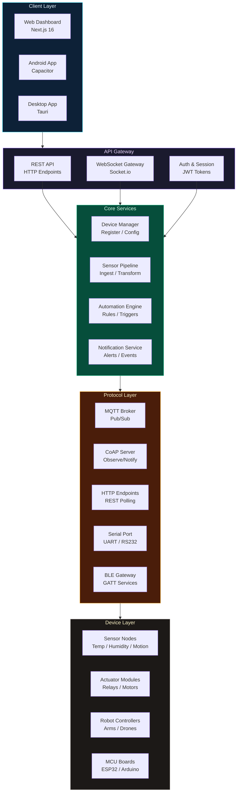
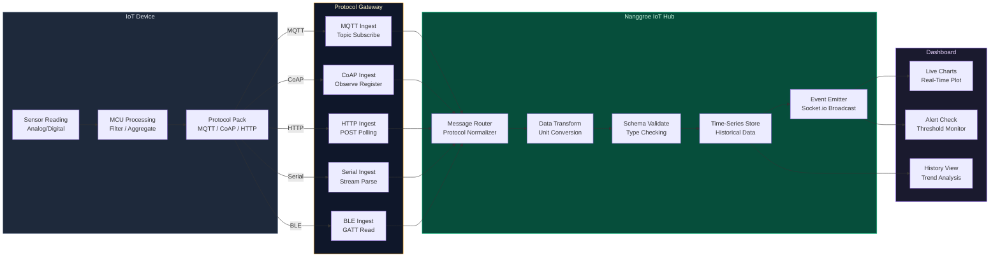
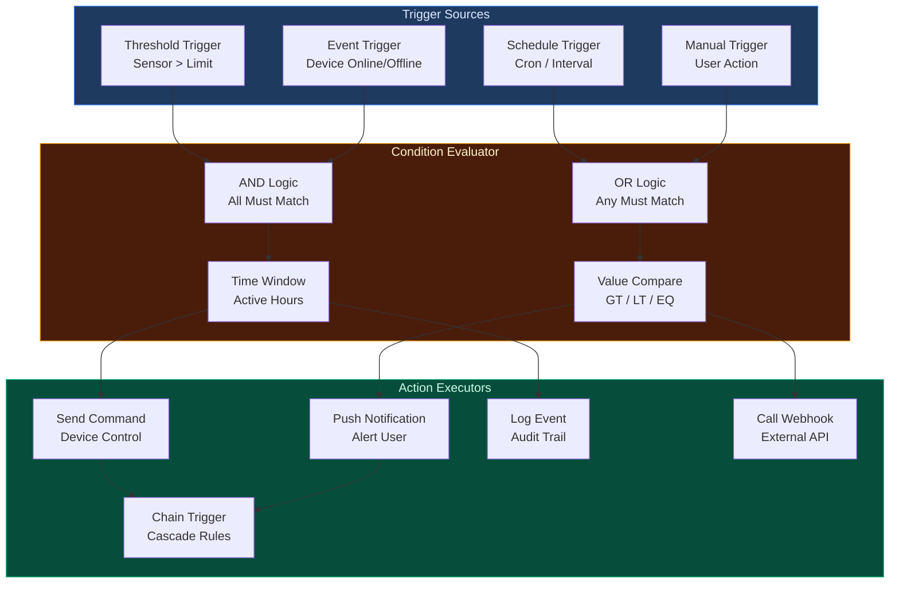
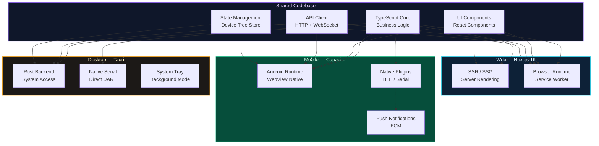
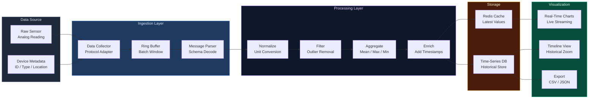

<a href="https://github.com/mulkymalikuldhrs/nanggroe-iot">
  
</a>

<div align="center">

[](https://git.io/typing-svg)

<br/>

[](https://github.com/mulkymalikuldhrs/nanggroe-iot)
[](https://github.com/mulkymalikuldhrs/nanggroe-iot)
[](https://github.com/mulkymalikuldhrs/nanggroe-iot)
[](https://github.com/mulkymalikuldhrs/nanggroe-iot)
[](LICENSE)

<br/>

[](https://github.com/mulkymalikuldhrs/nanggroe-iot/stargazers)
[](https://github.com/mulkymalikuldhrs/nanggroe-iot/fork)
[](https://github.com/mulkymalikuldhrs/nanggroe-iot/issues)

</div>

---

## Overview

Nanggroe IoT is a modular IoT and robotics platform with real-time hardware control and monitoring. Built with TypeScript, it provides a unified dashboard for managing IoT devices, streaming sensor data, and controlling hardware components through a responsive web interface. The platform leverages WebSocket connections for bi-directional, low-latency communication between devices and the control plane, enabling instant command dispatch and live telemetry visualization.

Whether you're orchestrating a fleet of sensors, controlling robotic actuators, or building a smart-environment dashboard — Nanggroe IoT provides the modular foundation to connect, monitor, and command your hardware with precision.

## Features

- **Device Management** — Register, configure, and monitor IoT devices from a central dashboard with auto-discovery support
- **Real-Time Control** — Send commands to hardware components via WebSocket connections with sub-second latency and guaranteed delivery acknowledgment
- **Sensor Dashboard** — Visualize sensor data with real-time charts, configurable alert thresholds, and historical trend analysis
- **Modular Architecture** — Plugin-based system that allows you to add new device drivers, protocols, and UI widgets without touching the core
- **Robotics Integration** — Control servo motors, actuators, and robotic arms with precision command scheduling and state feedback loops
- **Alert & Automation Engine** — Define rule-based triggers that automatically respond to sensor threshold breaches with configurable actions

## Architecture

```
┌─────────────────────────────────────────────────────────────────┐
│                      Nanggroe IoT Platform                      │
├─────────────────────────────────────────────────────────────────┤
│                                                                 │
│  ┌──────────────┐    ┌──────────────┐    ┌──────────────┐      │
│  │   Web Client  │    │  Mobile App  │    │   CLI Tool   │      │
│  │  (Dashboard)  │    │  (Remote)    │    │  (Terminal)  │      │
│  └──────┬───────┘    └──────┬───────┘    └──────┬───────┘      │
│         │                   │                   │               │
│         └───────────────────┼───────────────────┘               │
│                             │                                   │
│                    ┌────────▼────────┐                          │
│                    │   API Gateway   │                          │
│                    │  (REST + WS)    │                          │
│                    └────────┬────────┘                          │
│                             │                                   │
│         ┌───────────────────┼───────────────────┐               │
│         │                   │                   │               │
│  ┌──────▼───────┐  ┌──────▼───────┐  ┌──────▼───────┐        │
│  │   Device     │  │    Sensor    │  │  Automation  │        │
│  │  Manager     │  │   Pipeline   │  │   Engine     │        │
│  │              │  │              │  │              │        │
│  │ • Register   │  │ • Ingest     │  │ • Rules      │        │
│  │ • Config     │  │ • Transform  │  │ • Triggers   │        │
│  │ • Monitor    │  │ • Store      │  │ • Actions    │        │
│  └──────┬───────┘  └──────┬───────┘  └──────┬───────┘        │
│         │                  │                  │                │
│         └──────────────────┼──────────────────┘                │
│                            │                                    │
│                   ┌────────▼────────┐                          │
│                   │  Protocol Layer │                          │
│                   │                 │                          │
│                   │ • MQTT  • CoAP  │                          │
│                   │ • HTTP  • WS    │                          │
│                   │ • Serial • BLE  │                          │
│                   └────────┬────────┘                          │
│                            │                                    │
│              ┌─────────────┼─────────────┐                     │
│              │             │             │                     │
│       ┌──────▼──┐   ┌────▼────┐   ┌────▼────┐               │
│       │ Sensor  │   │ Actuator│   │ Robot   │               │
│       │ Nodes   │   │ Modules │   │ Arms    │               │
│       └─────────┘   └─────────┘   └─────────┘               │
│                                                                 │
└─────────────────────────────────────────────────────────────────┘
```

## Architecture & Data Flow Visualizations

### IoT Hub Architecture — Multi-Protocol Device Layer



### Device Communication Flow



### Automation Engine — Trigger / Condition / Action Pipeline



### Multi-Platform Client Architecture



### Sensor Data Pipeline



> **Maturity Note**: Nanggroe IoT is under active development. The multi-protocol gateway (MQTT, HTTP, WebSocket) is the most mature layer. CoAP, Serial, and BLE integrations are in progress. The automation engine supports basic trigger/action rules — advanced condition chaining is on the roadmap. The Capacitor (Android) and Tauri (Desktop) builds are functional but may lack some features available in the web dashboard.

---

## Quick Start

```bash
# Clone the repository

<!-- AUTO-PACKAGE-BADGES:START -->
<!-- Auto-generated package badges -->

   [](https://www.npmjs.com/package/nanggroe-iot)

<!-- AUTO-PACKAGE-BADGES:END -->
git clone https://github.com/mulkymalikuldhrs/nanggroe-iot.git
cd nanggroe-iot

# Install dependencies
npm install

# Configure environment
cp .env.example .env

# Start development server
npm run dev
```

The dashboard will be available at `http://localhost:3000`. Connect your IoT devices using the provided client libraries or the WebSocket API.

## Contributing

Contributions are welcome! Please follow these steps:

1. **Fork** the repository
2. Create a **feature branch** (`git checkout -b feature/amazing-feature`)
3. **Commit** your changes (`git commit -m 'Add amazing feature'`)
4. **Push** to the branch (`git push origin feature/amazing-feature`)
5. Open a **Pull Request**

Please ensure your code passes all linting checks (`npm run lint`) and tests (`npm test`) before submitting.

## Disclaimer

**For Education and Research Purpose Only**

This project is provided strictly for educational and research purposes. The authors and contributors assume **no responsibility or liability** for any damages, losses, or risks arising from the use of this software. **We do not bear any responsibility or risk** for how this software is used. Improper handling of hardware components through this platform may result in physical damage or injury — always follow proper safety protocols when working with electrical and robotic systems.

## License

This project is licensed under the MIT License — see the [LICENSE](LICENSE) file for details.

Copyright © 2024-2026 Mulky Malikul Dhaher. All rights reserved.

---

## Author

**Mulky Malikul Dhaher**
- GitHub: [mulkymalikuldhrs](https://github.com/mulkymalikuldhrs)
- Email: mulkymalikudhr@mail.com

<a href="https://github.com/mulkymalikuldhrs/nanggroe-iot">
  
</a>
